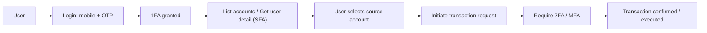

# Cross-Border Money Transfer System

## Overview

This project implements a robust, secure, and scalable cross-border money transfer system. It enables users to send money internationally with minimal fees and fast settlement times, integrating with third-party payment providers via asynchronous APIs and webhooks.

## Architecture

- **API Layer (`cmd/api/`)**: Exposes RESTful endpoints for user authentication, account linking, money transfer initiation, and webhook handling.
- **Service Layer (`pkg/service/`)**: Contains business logic for user management, transaction processing, and integration with payment providers.
- **DAO Layer (`pkg/dao/`)**: Handles database operations for users, transactions, and account information.
- **DTOs (`pkg/dto/`)**: Defines data transfer objects for API requests/responses and internal service communication.
- **Middleware (`pkg/middleware/`)**: Implements authentication, authorization, and request validation.
- **Logger (`pkg/logger/`)**: Centralized logging for observability and monitoring.
- **Utils (`pkg/utils/`)**: Utility functions for encryption, validation, and other common tasks.
- **Config (`pkg/config/`)**: Configuration management for environment variables and constants.

## Functional Highlights

### 1. User Authentication & Account Linking
- Users log in using their mobile number.
- Third-party API fetches all financial accounts linked to the mobile number.
- Users select the source account for transfers.
- Multi-factor authentication (MFA) is supported.

### Authentication modes (SFA vs MFA)

This project supports two levels of authentication, used together to balance friction and security:

- Single-Factor Authentication (SFA / 1FA):
	- Used for lower-risk read-only operations such as fetching user details and listing accounts for a user.
	- Protected by `middleware.OneFAMiddleware()` in the router.

- Multi-Factor Authentication (MFA / 2FA):
	- Required for higher-risk operations such as finalizing transfers, payouts, or any action that changes account state.
	- Protected by `middleware.TwoFAMiddleware()` in the router.

Routing summary (from `pkg/server/router.go`)

- Public / unauthenticated:
	- GET  /health
	- GET  /v1/generateOTP
	- POST /v1/verifyOTP
	- POST /v1/resetMPIN

- SFA (1FA) protected endpoints (OneFAMiddleware):
	- POST /v1/setMPIN         -> Set MPIN for a logged-in user
	- POST /v1/1fa/refresh     -> Refresh 1FA (SFA) session
	- POST /v1/verifyMPIN      -> Verify MPIN (SFA)
	- GET  /v1/accounts        -> Get accounts for a mobile number (read-only)
	- (read-only) GET /v1/accounts        -> Get accounts for a mobile number (read-only)

- MFA (2FA) protected endpoints (TwoFAMiddleware):
	- POST /v1/2fa/refresh     -> Refresh 2FA (MFA) session
	- POST /v1/transfer        -> Initiate a transfer (creates pending transfer) — requires 2FA to initiate
	- POST /v1/transfer/confirm -> Confirm or cancel a pending transfer (finalize): requires 2FA

Notes on security rules (intended behavior):
- User detail and user account detail (the endpoints used to fetch accounts) can be fetched using SFA (1FA). This is intentionally lower friction for listing and selection flows.
- All other account transactions (any operation that initiates transfers, modifies accounts, or performs sensitive actions) must require MFA (2FA). The current router enforces 2FA only on the 2FA refresh endpoint; when adding or changing endpoints that perform transactions, ensure `middleware.TwoFAMiddleware()` is applied to those route groups or routes.

### 2. Money Transfer Workflow
- Users specify source/destination currency, amount, and recipient details.
- System fetches real-time exchange rates and fees.
- Transfer requests are sent to the payment provider asynchronously.
- Transaction states: Initiated, Pending, In Progress, Completed, Failed.

### 3. Transaction Processing & Asynchronous Status Updates
- Webhook endpoints handle status updates from providers.
- Idempotency and out-of-order update handling ensure consistency.
- Failed transactions trigger reversal/refund logic.
- SMS notifications for key status changes.

### 4. Integration with Third-Party Payment Providers
- Secure API integration for transfer initiation and status updates.
- Supports multiple providers with fallback mechanisms.
- Refunds and reversals are handled gracefully.

## Non-Functional Features

- **Performance**: Optimized for P95 latency < 200ms for transfer requests.
- **Observability**: Centralized logging, monitoring, and alerting.
- **Security**: Encryption for sensitive data, fraud detection, and compliance mechanisms.

## Project Structure
```
mergemoney_assessment/
├── cmd/
│   └── api/
│       ├── local.yaml
│       └── main.go
├── external/
│   ├── external.go
│   ├── accountaggregator/
│   │   ├── accountaggregator.go
│   │   ├── connect.go
│   │   └── models.go
│   ├── fxratemanager/
│   │   ├── connect.go
│   │   ├── fxratemanager.go
│   │   └── models.go
│   └── paymentprovider/
│       ├── initiate.go
│       ├── paymentprovider.go
│       └── models.go
├── pkg/
│   ├── config/
│   │   ├── config.go
│   │   └── constant.go
│   ├── constant/
│   │   ├── auth.go
│   │   ├── constant.go
│   │   └── transfer.go
│   ├── dao/
│   │   ├── dao.go
│   │   ├── account/
│   │   │   ├── account.go
│   │   │   ├── info.go
│   │   │   ├── order.go
│   │   │   └── transaction.go
│   │   └── user/
│   │       ├── info.go
│   │       ├── profile.go
│   │       └── user.go
│   ├── database/
│   │   ├── constant.go
│   │   ├── create.sql
│   │   ├── model.go
│   │   └── postgres.go
│   ├── dto/
│   │   ├── account.go
│   │   ├── auth.go
│   │   ├── common.go
│   │   ├── login.go
│   │   ├── order.go
│   │   ├── transfer.go
│   │   └── user.go
│   ├── logger/
│   │   ├── gormlogger.go
│   │   └── logger.go
│   ├── middleware/
│   │   ├── auth.go
│   │   └── mfa.go
│   ├── server/
│   │   ├── router.go
│   │   └── server.go
│   ├── service/
│   │   ├── health.go
│   │   ├── service.go
│   │   └── v1/
│   │       ├── v1.go
│   │       ├── account/
│   │       │   ├── account.go
│   │       │   ├── info.go
│   │       │   └── transfer.go
│   │       ├── login/
│   │       │   ├── login.go
│   │       │   ├── mpin.go
│   │       │   ├── otp.go
│   │       │   └── verify.go
│   │       └── webhook/
│   │           ├── provider1.go
│   │           ├── provider2.go
│   │           └── webhook.go
│   └── utils/
│       ├── models.go
│       ├── utils.go
│       ├── identifier/
│       │   ├── base62.go
│       │   ├── constant.go
│       │   ├── identifier.go
│       │   └── snowflake.go
│       ├── redisclient/
│       │   ├── conn.go
│       │   ├── redisclient.go
│       │   └── redisgo.go
│       └── restclient/
│           ├── restclient.go
│           └── resty.go
├── sample_UI/
│   ├── accounts.html
│   ├── accounts.js
│   ├── api.js
│   ├── home.html
│   ├── home.js
│   ├── index.html
│   ├── main.js
│   ├── styles.css
│   ├── transfer.js
│   ├── verify.html
│   └── verify.js
└── README.md
```

## Authentication sequence

Below is a simple flow that describes the expected authentication and operation sequence in the system. It shows the minimal-login and account listing flow that uses Single-Factor Authentication (SFA / 1FA) and the higher-risk transaction flow that requires Multi-Factor Authentication (MFA / 2FA).

ASCII flow:

```
User -> [Login (mobile + OTP)] -> 1FA
1FA -> [List Accounts / Get User Detail] -> User selects account
User -> [Initiate Transaction] -> 2FA -> Transaction executed
```

Mermaid flow (rendered on platforms that support Mermaid):



Notes:
- The account listing and user detail steps are intentionally available with SFA to reduce friction during account selection.
- Any action that mutates account state (transfer initiation, account modification, payouts, etc.) must be protected by MFA (2FA). Ensure `middleware.TwoFAMiddleware()` is applied to those routes.
- If your API documentation or client apps render Mermaid diagrams, the above block will produce a visual flow. The ASCII flow provides a plain text alternative for environments that don't render Mermaid.


## High-Level Design

- **APIs**: RESTful endpoints for authentication, account linking, transfer initiation, and webhook updates.
- **Database**: Models for users, accounts, transactions, and audit logs.
- **Messaging/Async**: Webhook handlers ensure idempotency and correct transaction state transitions.
- **Security**: Data encryption, MFA, and fraud detection.

## Asynchronous Processing Strategy

- Webhook endpoints are idempotent and handle duplicate/out-of-order updates.
- Transaction state machine ensures consistent state transitions.
- Reconciliation logic detects mismatches between internal and provider records.

## Security & Compliance

- Sensitive data is encrypted at rest and in transit.
- MFA and fraud detection mechanisms are implemented.
- Audit logs for compliance and traceability.

## Run with Docker

The repository includes a `Dockerfile` and `docker-compose.yml` to run the service together with a Postgres instance pre-initialized with the schema and seed data.

What the compose setup does:
- Starts a Postgres 15 container with database `mergemoney` and user `postgres`/`postgres`.
- Initializes the database using `pkg/database/create.sql` (schema) and `pkg/database/seed.sql` (seed data).
- Builds the Go service image from the repository and runs the server.

Quick start

1. Build and start everything:

```bash
docker compose up --build
```

2. After startup:
- Postgres will be available on localhost:5432 (user: postgres / password: postgres, db: mergemoney).
- The Go service will be available on localhost:8080.

3. Verify seed data (example using psql):

```bash
docker exec -it $(docker ps -qf "ancestor=postgres:15") psql -U postgres -d mergemoney -c "select user_id, user_name, mobile from user_ref;"
```

4. Verify server is up (health):

```bash
curl -v http://localhost:8080/health
```

Notes:
- If you change the schema in `pkg/database/create.sql`, the initialization will only run for a fresh volume. To re-run the scripts, remove the `db-data` volume:

```bash
docker compose down -v
docker builder prune -af
```

- The containerized app uses a small wait-for-db wrapper so the server starts only after Postgres is reachable. The app accepts DB env vars `DB_HOST`, `DB_PORT`, `DB_USER`, `DB_PASSWORD`, `DB_NAME` which are set in `docker-compose.yml`.

Notable recent changes
----------------------

The codebase has received recent additions related to transfer handling, persistence, and UI flows. Below is a concise list of changes and how to exercise them locally for manual verification.

- New API endpoints
	- POST /v1/transfer (protected by OneFAMiddleware / 1FA)
		- Accepts a JSON payload matching `pkg/dto.TransferRequest`:
			{
				"source": { "sid": <int>, "currency": "<CUR>", "amount": <number> },
				"destination": { "currency": "<CUR>", "recipient_detail": {...}, "account": "...", "upi": "...", "wallet_id": "...", "type": "bank|wallet|cash" },
				"idempotency_key": "optional-string"
			}
		- Creates a transfer record with status `pending` and returns `transfer_id` and the idempotency key. If an identical `idempotency_key` exists the existing transfer is returned.

	- POST /v1/transfer/confirm (protected by TwoFAMiddleware / 2FA)
		- Accepts { transfer_id, action: "confirm"|"cancel", twofa_token? }
		- Finalizes the pending transfer: `confirm` sets status `success`, `cancel` sets status `failed` (error message "cancelled by user").

- Database
	- A new `transfers` table has been added in `pkg/database/create.sql` with the following notable columns: `transfer_id` (PK), `idempotency_key` (unique), `user_id`, `source_sid`, `source_currency`, `source_amount`, `destination_type`, `destination_payload` (JSONB), `status`, `error_message`, `created_at`, `updated_at`.
	- Indexes on `idempotency_key` and `user_id` were added.
	- Note: the SQL in `pkg/database/create.sql` runs only during DB initialization. To apply schema changes to an existing volume remove the DB volume and recreate the stack (see the Docker instructions above).

- DAO / Service changes
	- DAO: `pkg/dao/account` now exposes transfer-related methods: `SaveTransfer`, `GetTransferByIdempotencyKey`, `GetTransferByID`, and `UpdateTransferStatus`.
	- Service: `pkg/service/v1/account` persists new transfers as `pending` on POST /v1/transfer and implements `TransferConfirm` to finalize/cancel a pending transfer. Idempotency is respected when a client provides `idempotency_key`.

- UI / Client
	- A simple static UI is served from `/ui` (see `sample_UI/`) with pages for OTP login, accounts listing, and a transfer modal.
	- The transfer modal now builds payloads that match the server `TransferRequest` DTO and submits to `/v1/transfer` using the existing `fetchWithAuth` helper (which supports 1FA and 2FA flows and refresh-on-401).
	- After receiving a pending transfer response, the UI prompts the user for a 2FA code and calls POST /v1/transfer/confirm with `authType='2fa'` to complete the transfer.

- Webhooks
	- Several webhook endpoint stubs were added under `pkg/service/v1/webhook/` as placeholders for payment provider callbacks; they currently simulate provider notifications and should be extended to wire into the transaction state machine.

Quick manual test (happy path)
1. Start the stack with:

```bash
docker compose up --build
```

2. Open the sample UI at http://localhost:8080/ui/index.html and follow these steps:
	 - Generate OTP and verify (demo OTP flows are implemented in the test UI).
	 - On successful login you will have a 1FA session. Open Accounts and select a source account.
	 - Fill the transfer modal and submit. The server will create a pending transfer and return `transfer_id`.
	 - The UI will prompt for a 2FA code; enter the demo 2FA code and click Confirm. The UI calls `/v1/transfer/confirm` with `authType='2fa'` and shows success/failure feedback.

Notes & next steps
- The current transfer confirm handler simulates execution and sets the status to `success` or `failed`. For production, wire to real payment rails and handle asynchronous provider callbacks via webhooks.
- Consider adding a `GET /v1/transfers` endpoint and a Transfers UI to list a user's transfers and statuses (recommended next step).
- Consider adding a migration tool (go-migrate, goose, flyway) for safer schema updates rather than re-running `create.sql`.